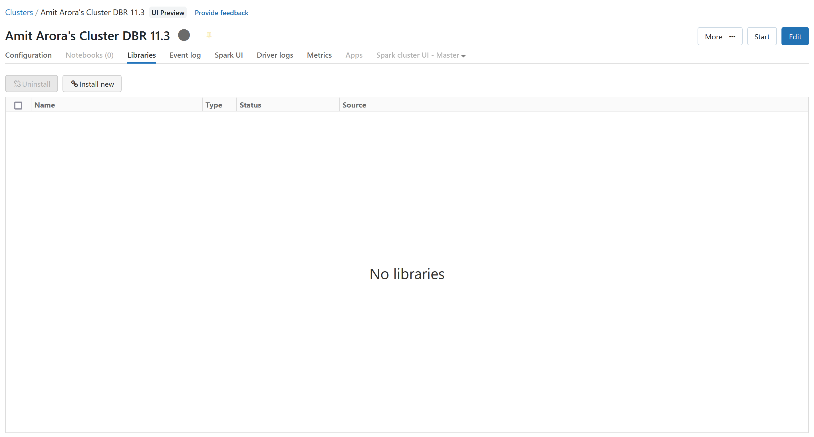
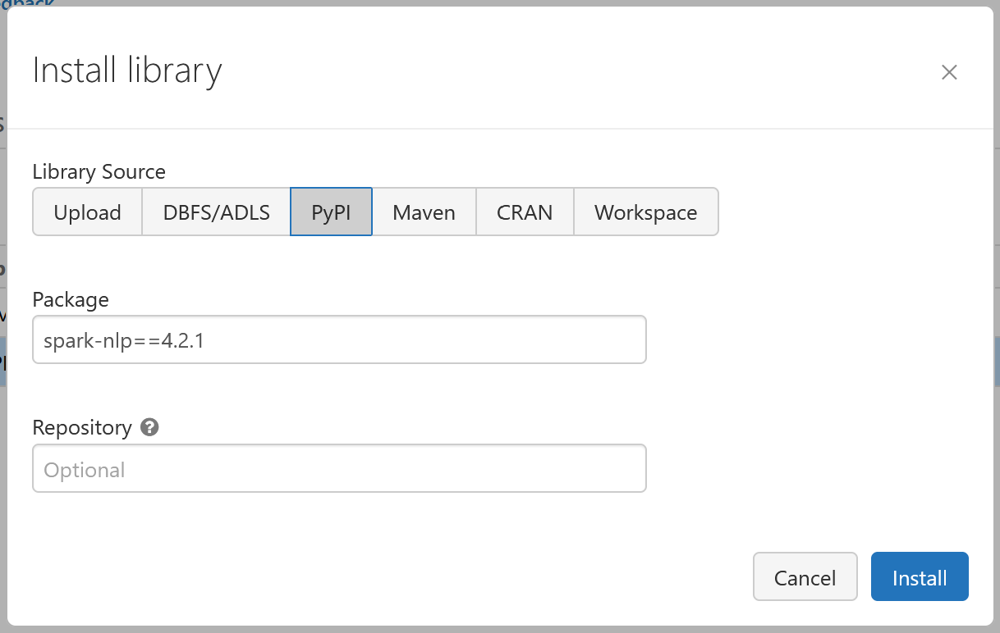
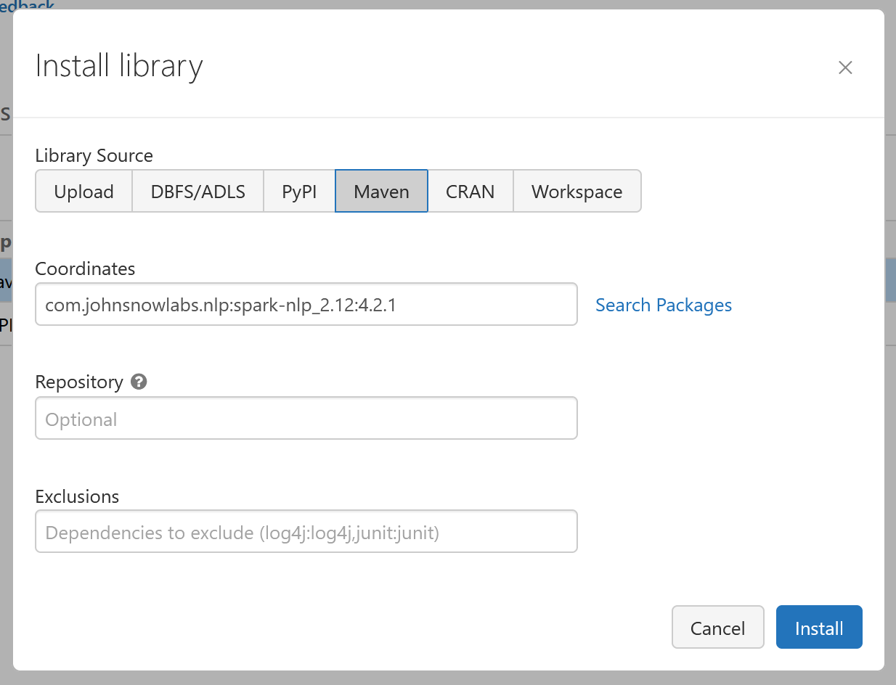
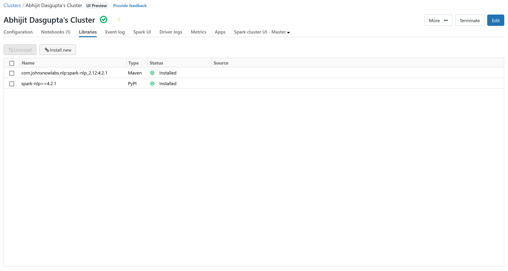

# Install `spark-nlp` on your Databricks Cluster

1. Navigate to your cluster and going to the `Libraries` tab. Then click on the `Install New` button.

    

2. Add the `spark-nlp` python library from the PyPi repostitory. Use the version `4.2.1`. The entry to the Packges text box will be `spark-nlp==4.2.1`. Then click the blue `Install` button.

    

3. Add the `spark-nlp` Java library from the Maven repostitory. Use the version `4.2.1`. The entry to the Coordinates text box will be `com.johnsnowlabs.nlp:spark-nlp_2.12:4.2.1`. Then click the blue `Install` button.

    

    Now you should have installed both the packages you need to conduct your NLP work. Just import the library

    

4. Restart the cluster